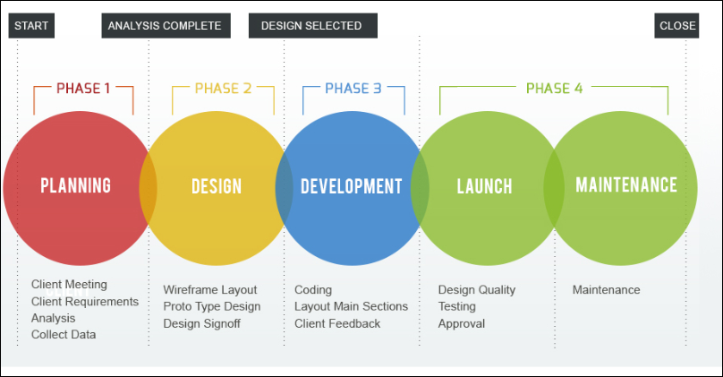
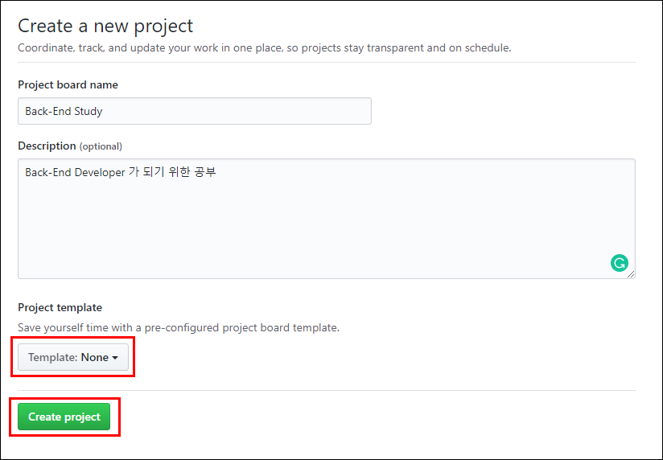

# Back-End Project
> 해당글은 백엔드가 이정도는 해줘야 함 이라는 PlanB 님의 시리즈글을 바탕으로 작성되었습니다

> Back-End Developer가 되기 위한/해야 하는 기본적인 것들에 대해 공부해 볼 것입니다.

## 개발 프로세스 정립
> 개발 프로세스는 개발도중 발생하는 이슈를 어떻게 관리하고, 어떠한 방식으로 작업을 진행할 것인지, 오나료된 작업은 어떤 과정을 거쳐 실제 제품에 반영시킬지에 관한 것들을 규칙화 시킨 것.

- 개발 프로세스

    

---

### 개발 프로세스 정립이 필요한 이유
- 각 개발자에게 할당된 작업들이 어떤 상태인지(준비 중/진행 중/완료)를 쉽게 알 수 있어야 함

- 실제로 작성하는 코드에만 집중하는 환경을 만들기 위해
  - 이슈를 실제 처리하는 입장에서, 개발 프로세스에 따라 작업을 진행하면 어느 브랜치에서 어떤 이름으로 브랜치를 생성할지/어느 브랜치로 pull request를 올리며 리뷰를 받아야할지/master merge 후 어떤 후속 작업을 진행해야 하는지와 같은 고민을 줄일 수 있음

- 생산성을 높이고 작업의 진행을 매끄럽게 만들고, 결과물의 퀄리티를 높이기 위해

---

## 이슈 관리 도구 (GitHub Issues & Projects)
> 이슈 관리 도구를 결정해야함

> '이슈'는 '작업' 이라고 보면 됨. '작업'을 기술함과 함께 나열하고, 작업을 처리할 작업자를 할당하는 등의 일을 위해 사용

> 이슈 관리 도구는 이슈 트래커 라고도 부름. (JIRA, Trello, Asana, GitHub 등)

### 요구사항
- 이슈 각각에 대해 작업자를 assign 할 수 있어야 함
- 이슈에 대해 커뮤니케이션 할 수 있어야 함
- 태그/라벨 등으로 이슈의 종류를 구분할 수 있어야 함 (feature, hotfix, enhancement)
- 이슈의 상태(To do, In progress 등)를 구분해서 시각화 할 수 있어야 함
- 되도록 GitHub내에서 해결할 수 있으면 좋음

### GitHub Issues & Projects
- 본인은 예전에 프로젝트 진행시 Trello를 사용했는데 충분히 좋은 툴 이지만 GitHub외의 다른 트래커를 따로 쓸만한 이유가 없다고 판단 (참고문서와 같은생각)
- JIRA는 돈이 들어간다고 함, 큰 조직에서 매니저 급이 태스크 관리시 용이
- 요구사항 모두 만족
  - assign, issue conversation 기능 존재
  - Customized label과 Filter by label 기능을 통해 이슈 종류 구분이 원활
  - Projects에 issues 기능을 연동해 이슈를 시각화 가능
  - Projects의 automation 기능을 통해 이슈 구분과 이슈 상태 자동 갱신도 가능
- GitHub issues 에서 이슈 등록시 해당 이슈에 번호가 매겨짐
  - 커밋 메시지에 #123과 같이 번호를 명시해 두면 자동으로 해당 이슈가 링크됨, conversation 할 때도 사용 가능

### 준비
- 미리 만들어둔 Repo의 Projects 탭에 들어가 새로운 프로젝트 생성

    

    
    - 템플릿은 None으로 설정 후 직접 구성

- 